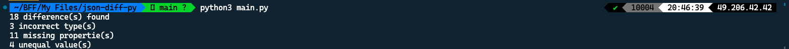

# 🚀 Quick start

1. **Installation**

   - Make sure to install the python version `3.9.6 64-bit` or later.

   - Run the following command to install the dependancy pip package(s).

     ```shell
     pip3 install deepdiff
     ```

2. **Run the project**

   - Run the following command to get the results back onto the terminal / cli.

     ```shell
     python3 main.py
     ```

3. **Explore**

   - Open the `resources` directory in your code editor of choice and edit `file_1.json` and `file_2.json`. Save your changes and then re-run the above command mentioned in step 2 to compare the updated files.

## 🔖 Sample result


